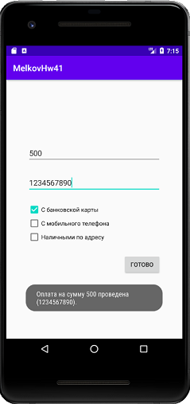

## Задача 1. Взаимоисключающие CheckBox.
### Описание
В сценариях использования мобильных приложений постоянно присутствует сценарий выбора из 2х и более вариантов. Для обеспечения этой возможности существует элемент CheckBox.

Создайте форму для приема оплаты из следующих элементов:

- EditText для ввода денег
- EditText для ввода информации об оплате
- Кнопка OK для подтверждения оплаты
- Несколько взаимоисключающих CheckBox для выбора способа оплаты- “С банковской карты”, “С мобильного телефона”, “Наличными по адресу”.
- При выборе соответствующего CheckBox- на EditText с информацией об оплате накладывается соответствующая маска- только цифры, только номер телефона или любой текст.
- При клике на кнопку “ОК”- выводим Toast с выбранной информацией.

